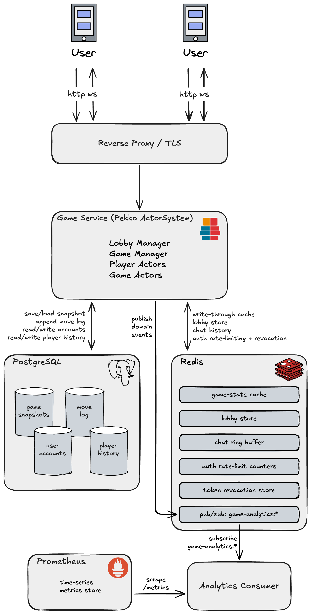
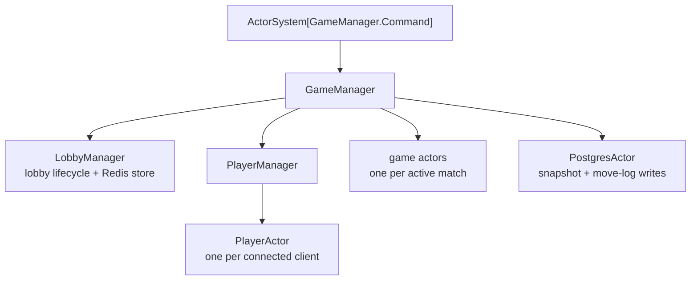
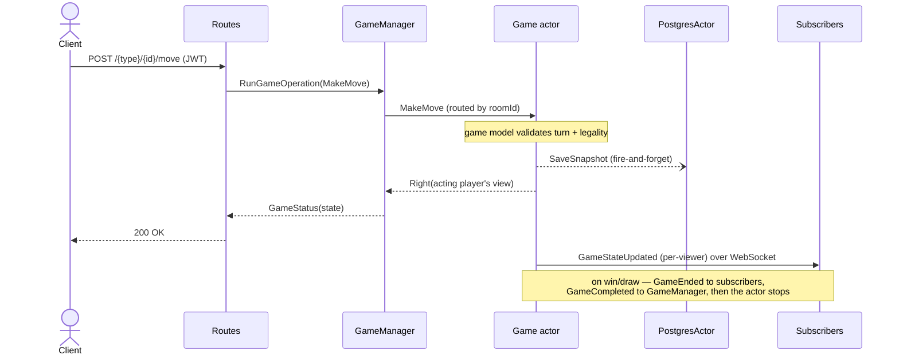
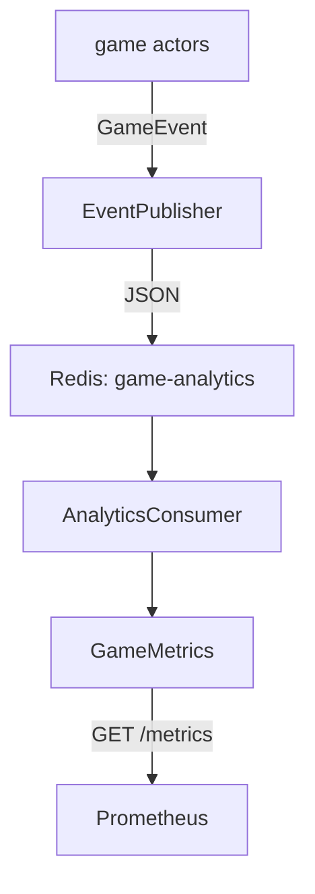

# pekko-game-service

[](https://github.com/andy327/pekko-game-service/actions/workflows/ci.yml)
[](https://codecov.io/gh/andy327/pekko-game-service)
[](https://opensource.org/licenses/MIT)

> A multiplayer, turn-based game backend in Scala/Pekko — real-time WebSocket play, durable game state, and a pluggable game-type model.

[](https://pekko-game-service.onrender.com/)

## Overview

**Pekko Game Service** is a backend for hosting multiplayer turn-based games. Players authenticate, gather in lobbies, and play matches whose moves are validated server-side and pushed to every participant in real time over WebSockets. Game state is the single source of truth held in a per-game actor, persisted to PostgreSQL, and cached in Redis so matches survive restarts.

The architecture is built around the actor model: each game is an isolated actor that serializes its own moves (no race conditions), and new game types plug in through a small `Game` trait plus a module registry. Games with hidden information (e.g. Battleship's fog of war, or Mastermind's hidden code) are supported through per-viewer state projection, so each player — and any spectator — only ever receives the slice of state they're allowed to see.

Although it runs as a single instance today, the system is **designed for horizontal scale from the ground up**, and the actor model is the foundation for getting there. A few choices made early reflect that intent: each match is an independent, self-contained game actor — a natural unit of sharding that can be relocated to any node without changing its logic; all durable state lives outside the process (PostgreSQL as system of record, Redis as a shared write-through cache), so instances hold no irreplaceable in-memory state and stay interchangeable; the HTTP layer is stateless and authenticates every request with a self-contained JWT, so REST traffic needs no sticky sessions; and analytics are decoupled over a Redis pub/sub channel rather than computed inline, letting the consumer side scale and evolve independently of gameplay. The remaining step — distributing those game actors across a cluster via Pekko Cluster Sharding — is on the [Roadmap](#roadmap), and the seams it needs are already in place.

## Features

**Built**

- 🔐 Credentialed accounts — register, log in, and change password (Argon2-hashed), issuing expiring JWTs for player actions
- 🏛️ Full lobby lifecycle — create, join, leave, list, and start matches
- 🔁 Post-game rooms — a finished match keeps its room alive for chat, and the host can start a same-roster rematch; idle/empty rooms are evicted automatically
- 🎲 Multiple game types — Tic-Tac-Toe, Connect Four, Battleship, Pig, and Mastermind
- ✅ Server-side move validation (turn order and legality enforced by the game model)
- ⚡ Real-time state delivery to all participants over WebSockets
- 🌫️ Per-viewer / fog-of-war state projection for hidden-information games and spectators
- 💬 In-match chat with persisted backscroll history
- 📜 Move history retrieval per game
- 🏅 Per-player game history — win/loss/draw records across completed matches, retrievable by the authenticated player
- 🧭 Live participation lookup — a player can ask "what am I in right now?" to re-discover their joined lobbies and active games after reconnecting
- 💾 Durable game state with write-through caching and restart recovery
- 📊 Metrics & analytics — game-lifecycle events aggregated into Prometheus metrics at a /metrics endpoint

**Planned** (see [Roadmap](#roadmap))

- 📈 Horizontal scaling via Pekko Cluster Sharding
- 🕹️ Additional game types and an AI opponent

## Requirements

### Functional

- **Authentication** — players register and log in with a password (Argon2-hashed) to obtain a JWT, which they present to perform actions. Tokens expire, so clients re-authenticate when a request returns 401; WebSocket connections are authenticated only at connect, so an expiring token never drops a live socket.
- **Lobbies** — create a lobby for a chosen game type; join, leave, and list open lobbies; start a match once the required number of players is present.
- **Post-game rooms & rematch** — when a match ends, its room survives in a non-joinable `Finished` state instead of disappearing: the same players keep chatting, and the host can start a rematch (same `start` call, same roster, seating rotated so the other player leads). A room with no connected players, or sitting idle, is evicted automatically after a grace period.
- **Gameplay** — submit moves; the server validates turn order and legality and applies them to authoritative game state.
- **Real-time updates** — connected players and spectators receive game-state changes pushed over WebSockets.
- **Hidden information** — players see only their own view of state; spectators receive a fog-of-war view (no leakage of hidden state).
- **Chat** — post messages within a match and retrieve recent history (backscroll).
- **History & status** — query a game's move history and current status, and retrieve the authenticated player's own record of completed games.
- **Live participation** — the authenticated player can list their current sessions: pre-game lobbies they've joined and in-progress games they're seated in (derived from live actor state, so it survives a reconnect or restart).
- **Persistence & recovery** — game state is durably stored; in-progress games are restored after a restart.

### Non-functional

- **Correctness / consistency** — one actor per game is the single source of truth, serializing moves so concurrent requests cannot corrupt state.
- **Low latency** — state changes are pushed to clients in real time rather than polled.
- **Durability + performance** — PostgreSQL is the system of record; Redis provides a write-through hot cache and ephemeral stores.
- **Fault tolerance** — games recover from persisted snapshots on restart.
- **Security** — authenticated actions, and no hidden-state information leakage via per-viewer projection.
- **Extensibility** — new game types are added through the `Game` trait and a module registry, without touching the actor/HTTP plumbing.
- **Testability** — pure game logic is isolated from I/O; integration tests run against real Postgres and Redis.
- **Observability** — game-lifecycle events are aggregated into Prometheus metrics, scrapable at `GET /metrics`.
- **Scalability** — single-instance today; designed to scale horizontally via cluster sharding (see [Roadmap](#roadmap)).

## Architecture

<picture>
  <source media="(prefers-color-scheme: dark)" srcset="docs/images/architecture-dark.png">
  
</picture>

The system runs as a single service instance, fronted by a reverse proxy, backed by PostgreSQL and Redis:

- **Reverse Proxy / TLS** — terminates HTTPS, proxies HTTP + WebSocket traffic to the service, and serves as the public endpoint. (Becomes a true load balancer once the service scales horizontally.)
- **Game Service (Pekko ActorSystem)** — the application. A `GameManager` supervises a `LobbyManager`, a `PlayerManager` (one `PlayerActor` per connected client), one game actor per active match, and a persistence actor. The Pekko HTTP route layer handles REST + WebSocket endpoints and JWT validation.
- **PostgreSQL** — durable system of record: game snapshots, an append-only move log, user accounts, and per-player game history.
- **Redis** — write-through game-state cache, lobby store, and chat ring buffer.
- **Analytics** — game actors publish domain events (game started, move made, game completed, chat sent) to a `game-analytics` Redis pub/sub channel; a decoupled consumer folds them into Prometheus metrics exposed at `GET /metrics`.

For the actor supervision tree, the move-flow sequence, and design rationale, see the [Design deep-dive](#design-deep-dive).

## Tech stack

| Area | Technologies |
|------|--------------|
| Language & runtime | Scala 2.13, Cats Effect, fs2 |
| Actors & HTTP | Pekko Typed Actors, Pekko HTTP, Pekko Streams |
| Persistence | Doobie, PostgreSQL, redis4cats (Lettuce), Redis |
| Serialization | Circe (JSON) |
| Auth | jwt-scala |
| Build & CI | sbt, GitHub Actions, Codecov |
| Infra & deploy | Docker / Docker Compose, Render |
| Testing | ScalaTest, Pekko TestKit, Testcontainers |

## Getting started

You'll need a JDK (17+), [sbt](https://www.scala-sbt.org/), and Docker (for Postgres and Redis). Clone the repo, bring up the datastores, and run the server:

```
$ git clone https://github.com/andy327/pekko-game-service.git
$ cd pekko-game-service/
$ docker-compose up -d          # starts PostgreSQL and Redis
$ sbt run
```

That's it — the service listens on `http://localhost:8080`. The schema is created on first boot, and the bundled defaults match the `docker-compose.yml` credentials, so there's nothing to configure for local play.

### Configuration

Every setting has a working default for local development and can be overridden by an environment variable:

| Variable | Default | Purpose |
|----------|---------|---------|
| `PORT` | `8080` | HTTP port the service binds to |
| `DATABASE_URL` | `jdbc:postgresql://localhost:5432/gamedb` | PostgreSQL connection string |
| `DB_USER` / `DB_PASSWORD` | `gameuser` / `gamepass` | PostgreSQL credentials |
| `REDIS_URI` | `redis://localhost:6379` | Redis connection string |
| `JWT_SECRET` | `local-dev-secret` | HMAC signing key for JWTs — **set this to a strong secret in any real deployment** |
| `JWT_TTL` | `1h` | Lifetime of an issued access token |
| `CHAT_MAX_MESSAGES` | `100` | Per-match chat backscroll retained for `GET /chat` |
| `ARGON2_MEMORY_KIB` / `ARGON2_ITERATIONS` / `ARGON2_PARALLELISM` | `19456` / `2` / `1` | Argon2id password-hashing cost (OWASP baseline) |

### A two-minute walkthrough

Tic-Tac-Toe needs two players, so we'll register two accounts, gather them in a lobby, start the match, and make the opening move. The examples use [HTTPie](https://httpie.io/) for readability; `curl` works just as well.

Register two players. Each call returns a signed JWT — grab one for each player:

```
$ http POST :8080/auth/register username=alice email=alice@example.com password=hunter2-aaaa
$ http POST :8080/auth/register username=bob   email=bob@example.com   password=hunter2-bbbb
```

```jsonc
{ "token": "eyJhbGciOi..." }   // save Alice's as $ALICE and Bob's as $BOB
```

Alice creates a Tic-Tac-Toe lobby (she becomes the host); the response carries the new `roomId`:

```
$ http POST :8080/lobby/create/tictactoe "Authorization: Bearer $ALICE"
```

Bob joins it, then Alice — the host — starts the match:

```
$ http POST :8080/lobby/$ROOM_ID/join  "Authorization: Bearer $BOB"
$ http POST :8080/lobby/$ROOM_ID/start "Authorization: Bearer $ALICE"
```

Now play. Moves are game-specific JSON; for Tic-Tac-Toe that's a zero-based `(row, col)`, with `(0,0)` at the top-left. Alice (X) takes the center:

```
$ http POST :8080/tictactoe/$ROOM_ID/move "Authorization: Bearer $ALICE" row:=1 col:=1
```

The response is the updated board, and every connected participant is pushed the new state over their WebSocket in real time (see [API reference](#api-reference) for the `/ws` protocol). Bob can reply with his own `move`, and so on until someone wins or the board fills.

## API reference

All gameplay endpoints require a `Authorization: Bearer <jwt>` header; obtain a token from `/auth/register` or `/auth/token`. Paths with a `{gameType}` segment accept `tictactoe`, `connectfour`, or `battleship`.

### Auth

| Method | Path | Description |
|--------|------|-------------|
| `POST` | `/auth/register` | Create an account (`username`, `email`, `password`) and receive a JWT |
| `POST` | `/auth/token` | Authenticate with `email` + `password` and receive a JWT |
| `POST` | `/auth/password` | Change the authenticated account's password (does not revoke existing tokens) |
| `GET`  | `/auth/whoami` | Return the caller's player `id` and `name` decoded from the token |

### Lobbies

| Method | Path | Description |
|--------|------|-------------|
| `POST`   | `/lobby/create/{gameType}` | Create a lobby for a game type; the caller becomes host |
| `GET`    | `/lobby/list` | List all open lobbies |
| `GET`    | `/lobby/{roomId}` | Fetch metadata for one lobby |
| `POST`   | `/lobby/{roomId}/join` | Join an open lobby |
| `POST`   | `/lobby/{roomId}/leave` | Leave a lobby (or forfeit an in-progress game) |
| `POST`   | `/lobby/{roomId}/start` | Start the match (host only); also doubles as the rematch call when the room is in its post-game `Finished` state |
| `DELETE` | `/lobby/{roomId}` | Cancel a pre-game lobby (host only) |
| `POST` / `DELETE` | `/lobby/{roomId}/subscribe` | Start / stop spectating a lobby's push events |

### Gameplay

| Method | Path | Description |
|--------|------|-------------|
| `POST`   | `/{gameType}/{roomId}/move` | Submit a move; payload shape is game-specific (e.g. `{ "row": 1, "col": 1 }` for Tic-Tac-Toe) |
| `GET`    | `/{gameType}/{roomId}/status` | Fetch current game state (your view) |
| `GET`    | `/{gameType}/{roomId}/history` | Fetch the ordered move log |
| `GET`    | `/{gameType}/{roomId}/chat` | Fetch recent chat backscroll |
| `POST` / `DELETE` | `/{gameType}/{roomId}/subscribe` | Start / stop spectating a game's push events |

### Player & metrics

| Method | Path | Description |
|--------|------|-------------|
| `GET` | `/players/me/sessions` | The caller's live lobbies and active games (survives reconnect) |
| `GET` | `/players/me/history` | The caller's completed-game win/loss/draw record |
| `GET` | `/metrics` | Prometheus metrics (text exposition format 0.0.4) |

### WebSocket protocol

After authenticating, a client opens a single WebSocket to `GET /ws` (Bearer token required at connect). The connection is the player's real-time channel for every match and lobby they're part of; it's authenticated only at connect, so an expiring token never drops a live socket.

**Server → client** frames are JSON-tagged by `type`:

| `type` | Payload | Sent when |
|--------|---------|-----------|
| `LobbyUpdated` | lobby `metadata` | A player joins/leaves or the lobby's status changes, including the room turning `Finished` after a match ends, or `InProgress` again on rematch |
| `GameStateUpdated` | the viewer's `state` | A move is applied — each recipient gets their own per-viewer projection |
| `GameEnded` | final `result` | The game reaches a win or draw, or a post-game room is evicted for sitting idle/empty |
| `ChatMessage` | `roomId`, `senderId`, `senderName`, `text`, `sentAt` | Anyone watching that match posts chat |

**Client → server** frames are likewise tagged by `type`. Today the sole inbound message is chat; unrecognized or malformed frames are logged and dropped:

```jsonc
{ "type": "ChatSend", "roomId": "<uuid>", "text": "good luck!" }
```

REST actions (joining, starting, moving) and WebSocket pushes work together: you `POST` a move over HTTP and receive the resulting state both in the HTTP response and as a `GameStateUpdated` push to every participant.

## Design deep-dive

How the pieces fit together: the actor supervision tree, what happens on a move, how state is persisted and recovered, how hidden-information games stay hidden, and how to add a game type.

### Actor model and supervision

Every piece of mutable game state lives inside an actor, and actors only ever communicate by sending messages — so there are no locks and no shared mutable state to race on. A single `GameManager` sits at the root and owns what must be coordinated centrally: spawning game actors, routing operations to them, and restoring state on startup. It delegates the two concerns that have their own lifecycle to dedicated children — lobbies to a `LobbyManager`, and player sessions to a `PlayerManager` (one `PlayerActor` per connected client). A `PostgresActor` handles all database writes.



Each game actor is the single source of truth for one match. Because an actor processes one message at a time, the moves within a game are serialized for free: two players submitting at once are simply handled in arrival order, and neither can observe a half-applied board.

### The move lifecycle

A move is server-authoritative end to end. The client POSTs it; the route hands it to `GameManager`, which routes it by `roomId` to the right game actor; the actor asks the pure game model to validate and apply it. Only if the model accepts the move does anything change.



Two things are worth calling out. First, persistence is **fire-and-forget**: the actor fires a snapshot save at the `PostgresActor` and replies to the caller without waiting for the write to land, so a move's latency is never gated on the database. Second, once a move produces a win or a draw, the game actor emits a final `GameEnded` to everyone watching, tells `GameManager` the game is over, and stops itself — completed games don't linger in memory, and later status requests are served from the database instead.

### Persistence and recovery

PostgreSQL is the system of record. A game's state is stored there in two forms: the **snapshot** is the current state, overwritten on every move, and it's what a game is restored from; the **move log** is an append-only history of every move, which never changes and powers the `/history` endpoint. Two more things outlast any single match and live in Postgres too — **user accounts** (durable player identity) and each player's **completed-game history** (win/loss/draw records). Redis sits in front of the snapshot as a write-through cache (the lobby store and chat backscroll live there too), so a hot game is read from memory while Postgres stays the durable copy; the move log, accounts, and history are Postgres-only.

On startup `GameManager` doesn't accept traffic blindly — it kicks off an asynchronous restore (`loadAllGames` + `loadAllLobbies`), stashing incoming messages until the restore finishes, then replays them against the recovered state. In-progress games come back exactly where they left off, which is what makes a restart invisible to connected players.

### Per-viewer projection (fog of war)

A game actor never ships its raw internal state to anyone. When it needs to send state out — as a move reply or a push — it renders a **view** for a specific viewer through a `GameStateView` type class: `serialize(game, Some(playerId))` for that player's own view, `serialize(game, None)` for a public/spectator view. Full-information games (Tic-Tac-Toe, Connect Four, Pig) ignore the viewer and show everyone the same board. For Battleship the projection is where fog of war is enforced: your own ships are visible to you, your opponent's are hidden, and a spectator sees both boards fogged. Mastermind works the same way — the codemaker's secret code is hidden from the codebreaker (and spectators) until the game ends. No code path can leak hidden state, because the unredacted model never leaves the actor.

### Real-time delivery

Each connected client holds one WebSocket, backed by a `PlayerActor`. When a game or lobby changes, the relevant actor fans a `PlayerEvent` out to every subscriber's `PlayerActor`. The actor layer deals only in domain events — `GameStateUpdated`, `GameEnded`, `LobbyUpdated`, `ChatMessage` — and JSON rendering happens at the WebSocket edge in the server module. This is the boundary the [module split](#project-structure) makes physical: the actors have no idea what a WebSocket or a JSON encoder is.

### Observability and analytics

The same lifecycle moments that drive gameplay also feed a metrics pipeline — but the two are kept completely apart, so analytics can never slow a game down. As games start, moves land, matches end, and chat is sent, the actors emit small domain events — `GameStarted`, `MoveMade`, `GameCompleted`, `ChatSent` — through an `EventPublisher` seam and move on. They know nothing more about it: `NoOpEventPublisher` is the default, so analytics is entirely opt-in and a slow or broken consumer can't stall a move.



On the producing side, `RedisAnalyticsPublisher` serializes each event and publishes it to a dedicated `game-analytics` Redis channel. On the consuming side — a background fiber started before the server accepts connections — `AnalyticsConsumer` reads that stream, decodes each event, and folds it into a small set of Prometheus collectors (`GameMetrics`): games started and completed by outcome, move counts, and chat volume, each labelled by game type. Those are exposed at `GET /metrics` in Prometheus' text format, ready to scrape.

Two deliberate choices shape this. The metrics are intentionally low-cardinality — keyed on `game_type` and `outcome` (won/draw/forfeit), never on player identity, so the series count stays bounded. And the thing on the wire is the producer's own `GameEvent`, not a rendered board view, so no per-player or hidden state ever reaches the analytics path. "Analytics" is really just the name of this one consumer; the event seam itself is generic, which is what would make adding a second listener — an audit log, a player-stats writer — a matter of subscribing rather than touching the actors.

### Adding a new game type

New games plug in without touching the actor or HTTP plumbing. Write the pure game model (a `Game` implementation in `game-service-model`), then add two small pieces in the actor module:

1. A **`GameActor[G]`** — for a turn-based game this is a one-line binding, since all the move/persist/fan-out/lifecycle logic lives once in the shared `TurnBasedGameActor`:
   ```scala
   object MyGameActor extends TurnBasedGameActor[MyGame, MyMove, ...](players => MyGame.empty(players), deriveEncoder[MyMove])
   ```
2. A **`GameModule[G]`** with three methods: `moveDecoder` (a Circe decoder for your move payload), `toGameCommand` (map a generic operation to your actor's command), and `serialize` (render the model to a view via `GameStateConverters`).

Then register the pair in `GameRegistry.forType`. That single `case` is the only wiring — routing, validation, persistence, and WebSocket delivery are all generic and pick the new type up automatically.

## Project structure

- `game-service-model` — pure game logic: the `Game` trait and per-game implementations (no I/O).
- `game-service-persistence` — the persistence layer: Doobie/PostgreSQL and Redis repositories, plus Circe codecs.
- `game-service-actor` — the actor system and domain orchestration: `GameManager`, `LobbyManager`, `PlayerManager`, the per-game actors, the persistence actor, the game registry/modules, the lobby and chat domains, per-viewer state projection, and the game-event emit seam.
- `game-service-server` — the transport edge: Pekko HTTP routes, JWT auth, the JSON protocol, WebSocket delivery, and the analytics consumer (Prometheus metrics).

## Testing

The test strategy mirrors the module layout — pure logic is tested in isolation, and anything with I/O is tested against the real thing in a container.

- **Model specs** (`game-service-model`) — the game rules as plain unit tests: win/draw detection, turn order, legal and illegal moves, per-game edge cases. No actors, no I/O.
- **Actor specs** (`game-service-actor`) — `GameManager`, `LobbyManager`, `PlayerManager`, and the game actors driven through Pekko's `ActorTestKit` with `TestProbe`s, asserting on the domain events and replies they emit. In-memory repository fakes stand in for persistence, keeping these fast and deterministic.
- **Integration specs** — the Redis and Postgres repositories run against **real** datastores via Testcontainers (`game-service-persistence` for the repositories, `game-service-actor` for the Redis-backed lobby and chat stores), so the SQL and Redis commands are exercised for real rather than mocked.
- **Route specs** (`game-service-server`) — the HTTP and WebSocket endpoints through Pekko HTTP's route testkit and `WSProbe`, reusing the actor module's in-memory fakes.

Run them with:

```
$ sbt test          # all modules
$ sbt actor/test    # a single module
```

`sbt ci` runs the full gate the way CI does — formatting and lint checks, the whole suite, and coverage. The integration specs need a running Docker daemon for Testcontainers.

## Roadmap

Planned work, in rough priority order:

- **Horizontal scaling (Pekko Cluster Sharding)** — today the service is single-instance (lobbies, game actors, and player sessions live in one JVM). The target is to shard game and lobby entities across a Pekko cluster so play is location-transparent across nodes. Cluster messaging would carry cross-instance delivery between game actors and player sessions directly, while the analytics event stream survives unchanged. Kept deliberately out of the main architecture diagram above so it reflects what's actually deployed.
- **Authentication hardening** — the credentialed auth in place covers registration, login, and password change, with Argon2id hashing, short-lived tokens, and login timing-equalization to blunt email enumeration. Considered and deliberately deferred: **token revocation** — JWTs are stateless, so a password change or "log out" doesn't invalidate already-issued tokens before they expire; closing that needs a per-account token version baked into the claim (or a `jti` denylist in Redis) checked at validation time. **Password reset** (forgot-password) — needs an out-of-band channel (email) and a single-use, TTL'd reset-token store (a natural fit for Redis), so it's gated on an email integration. **Rate limiting / lockout** on the auth endpoints to slow credential stuffing, and **email-address verification** at registration, are likewise out of scope for now. The short token TTL keeps the revocation gap small in the meantime.
- **OAuth / social login** — a second `IdentityProvider` (e.g. Google/GitHub) plus a callback route, resolving an external identity to the same `Account` and reusing token issuance and the account store unchanged. The `IdentityProvider` seam exists precisely so this is additive; the open design questions are account-linking policy (same email via password and OAuth) and how non-browser clients complete the redirect.
- **More game types** — additional turn-based games beyond the current five (e.g. Liar's Dice, Texas Hold 'Em).
- **AI opponent** — a bot player for single-player matches and testing.
- **Load testing** — throughput/latency benchmarking, plus retention policies for snapshots and move logs.

## License

This project is licensed under the [MIT License](LICENSE).
