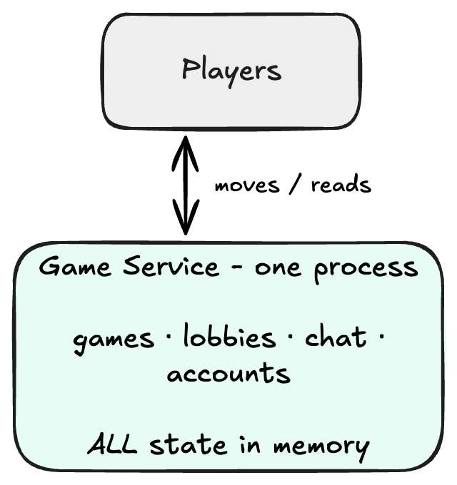
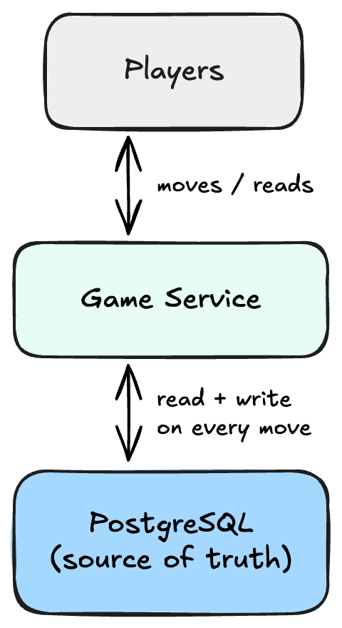
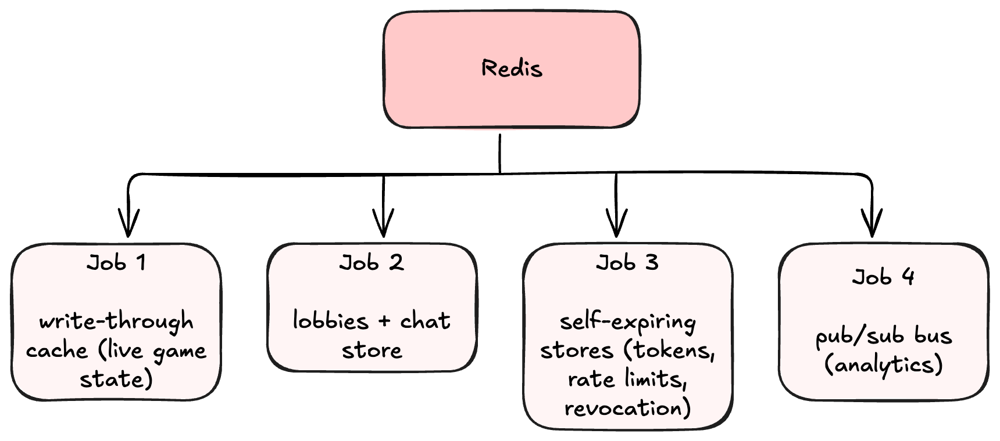
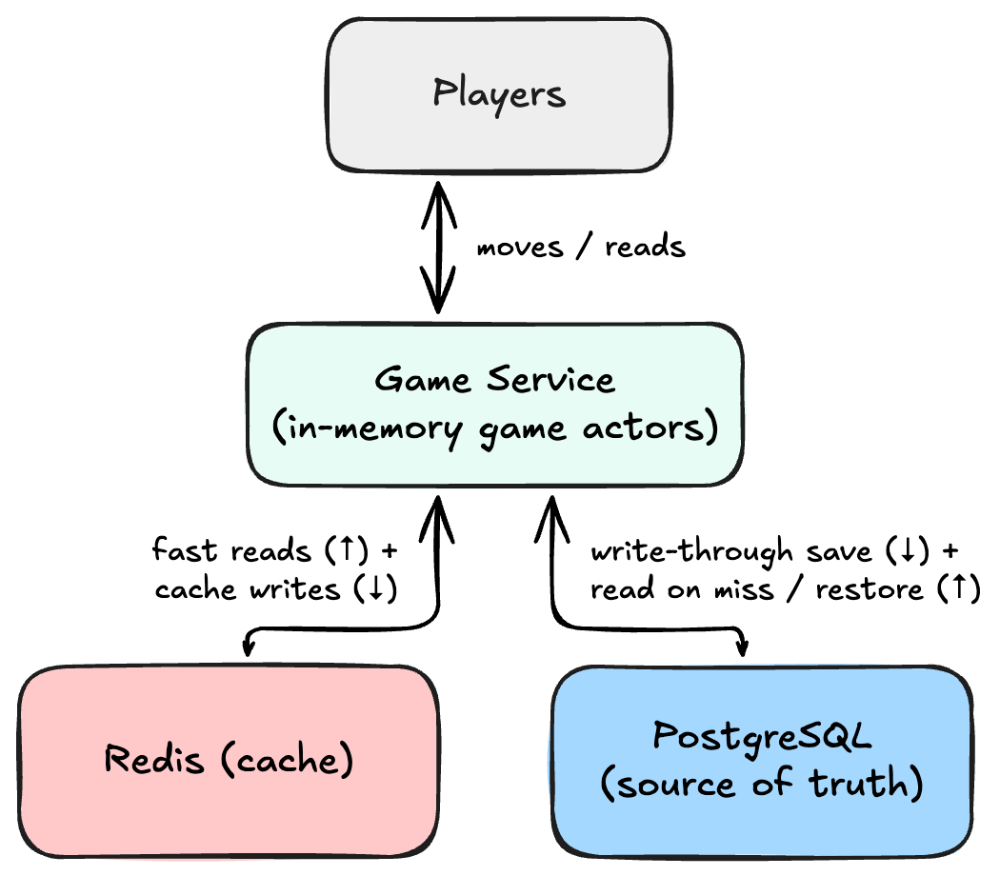
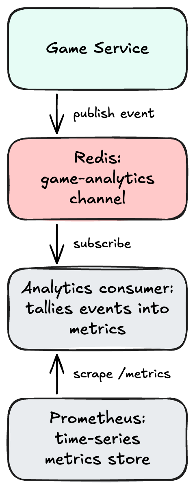

# Fast and Durable: How Redis and Postgres Split the Work in a Game Backend

*A real-time game backend, and how it keeps state fast, correct, and durable — by refusing to make one store do every job.*

> *"A decision first has meaning when it's the basis for the following decision."*
> — Erwin Smith, *Attack on Titan*

I built a backend for multiplayer, turn-based games — tic-tac-toe, Connect Four, Battleship, poker, and a few others. Players authenticate, gather in lobbies, and play matches whose moves are validated on the server and pushed to everyone in real time. It's a fun domain, but underneath the games sits a question that any service holding fast-changing state has to answer sooner or later: **where does the state live, and how do we keep it fast, correct, and durable all at once?**

This article is about that question. Rather than present the final design as if it sprang fully formed, we'll walk through it the way it actually evolved — start with the simplest thing that could work, watch it hit a wall, fix the wall, watch the fix create a new problem, and keep going until the pieces settle — each choice handing us the next problem to solve. By the end, one store ([PostgreSQL](https://www.postgresql.org/)) is doing exactly one job, and another ([Redis](https://redis.io/)) is quietly doing four.

## Four lenses for judging a design

To compare designs honestly, we need to agree on what "better" means. We'll judge every stage against four properties:

- **Latency** — how fast is a player's action? A move should feel instant.
- **Durability** — does state survive a crash, deploy, or restart?
- **Consistency** — can two things happening at once corrupt the state?
- **Scale** — can it hold enough data, and can we ever run more than one instance?

Keep these four in mind. The whole story is that each design is great at some of them and terrible at others.

> The interesting work is finding an arrangement that stops forcing us to trade one for another.

## The engine underneath: the actor model (and why Pekko)

One design choice sits below everything else, so it's worth a paragraph before we start. The service is built on [Pekko](https://pekko.apache.org/) (an open-source fork of Akka) using its typed **actors**. An actor is a lightweight worker that *owns some state* and communicates only by sending and receiving messages — it never shares memory with anyone. Critically, each actor processes its messages **one at a time**.

That single property buys us two of our four lenses almost for free. **Consistency:** if each match is handled by its own actor, then two players moving at the same instant are just two messages handled in sequence — there's exactly one owner of the board and one writer, so nothing can half-apply, and we never need a lock. **Latency:** because an actor keeps its state in memory and does one thing at a time, handling a move is a quick, uncontended operation. I chose Pekko specifically because this "one isolated worker per game" model maps perfectly onto the domain — a game *is* a little state machine that should process moves in order — and because, as we'll see at the very end, that same boundary is exactly what a system needs to distribute across many machines later.

With that engine in mind, let's start as simply as possible.

## Stage 0: everything in memory

The simplest possible design keeps all state in the process. Each active match's board lives in its game actor's memory; so do the open lobbies, the recent chat, and the user accounts. Nothing else exists.

<p align="center"></p>

It's worth being generous about how good this is, because it sets a bar we'll spend the rest of the article trying not to fall below:

- **Latency is exceptional.** Reading or updating state is a memory access. A move is *receive message → change board → reply*. Microseconds.
- **Consistency is easy** — for the reason we just covered: one actor per game, one message at a time.

But two things break it, and one of them is fatal:

- **Durability is zero — and this is the fatal one.** Memory is volatile. The instant the process stops — a deploy, a crash, an out-of-memory exception, or (on a cheap cloud tier) the instance idling out and being recycled — *everything* is gone. Games vanish mid-match. Users can't even log back in, because the accounts evaporated too. A backend that forgets everyone on restart isn't a backend; it's a demo.
- **Scale is capped at one machine, in two different ways.** Everything has to fit in one process's memory, including every account ever registered, forever. And we can never run a *second* instance, because **the state _is_ the instance** — a player on server A and a player on server B could never see the same game. One machine also means one point of failure and no zero-downtime deploys.

**And what about state that's _meant_ to expire?** Some data is only useful for a little while, and keeping it around longer is actively wrong. A password-reset link should stop working after an hour so a leaked email can't be used next week; a "5 attempts per minute" login limit only makes sense if the count resets every minute; a "locked out for 5 minutes" flag is, by definition, temporary. In a pure in-memory world we'd hand-roll all of that with background timers, and lose it on restart anyway. We'll come back to this idea a few times later in the article.

| Design | Latency | Durability | Consistency | Scale |
|---|---|---|---|---|
| In-memory only | ✅ excellent | ❌ lost on restart | ✅ strong | ❌ one machine |

The verdict: durability is unacceptable and we're locked to a single machine forever. But **latency and consistency are exactly what we want** — so the goal from here is to fix durability and scale *without giving those two back.*

## Stage 1: PostgreSQL as the single source of truth

The obvious fix is to put the state somewhere durable. On every move, write the game's state to a database; keep accounts, a move log, and match history there too. On startup, read it all back and pick up where we left off.

<p align="center"></p>

This is the version many services stop at, and it fixes real problems:

- **Durability — solved.** Postgres is on disk and transactional. Crash, redeploy, restart — reload from Postgres and the games resume. Accounts persist. This is the entire reason to take the step.
- **Scale (capacity) — solved.** State is no longer bounded by one process's memory. We keep only *active* games in memory and let everything cold live on disk.
- **Scale (horizontal) — now _possible_.** This is subtle but important: by moving the state *out* of the process, the instances stop being special. The truth now lives in a shared store both could reach, so the state isn't trapped in one process anymore. That's the precondition for ever running more than one node — though, as we'll see, it isn't the whole job.
- **Consistency — strong.** By this we mean two concrete things Postgres gives us. First, there's now a **single authoritative copy** of each piece of data — one definitive value in one place, rather than several copies that might disagree. Second, writes happen inside **transactions**: a group of changes that either all succeed or all fail together, and that are isolated from other writers in progress, so two concurrent updates can't interleave and leave the data half-written.

But look at what it costs — and every cost lands on the two things Stage 0 was best at:

- **Latency regresses, badly.** A database round-trip — cross the network, parse the query, wait on a connection from a limited pool, touch the disk — is orders of magnitude slower than a memory access. If a move has to wait for a Postgres write, move latency is now *gated on the database.* Reads regress too.
- **The database becomes a bottleneck.** Every game's every move now converges on one relational engine, overwriting a row each time. **The single source of truth is also a single point of contention** — "contention" meaning lots of concurrent work competing for the same limited resource (the one database, its connection pool, the locks on the rows being written). When everyone lines up at the same door, they wait. Relational databases are superb at many things, but being used as a high-frequency, constantly-overwritten scratchpad for hundreds of live matches is not what they're optimized for.
- **It's a heavyweight tool for a lightweight job.** A game's state is really just *a key and a blob of JSON* — a `get` and a `put`. But Postgres, on every one of those, does a lot of extra work that's valuable for relational data and wasted here: it parses the SQL, plans how to execute it, opens a transaction (taking locks, writing to its crash-recovery journal, enforcing isolation), and keeps indexes and constraints up to date. For fetching one blob by its key, that's a lot of machinery.

**And expiring state?** Now we'd add an `expires_at` timestamp column, write a scheduled background job — a "sweeper" that periodically scans the table and deletes rows whose time has passed — and remember to filter out the expired ones on every read. It works, but it's three more moving parts, and more load on the database we were already worried about.

| Design | Latency | Durability | Consistency | Scale |
|---|---|---|---|---|
| In-memory only | ✅ excellent | ❌ lost on restart | ✅ strong | ❌ one machine |
| + PostgreSQL (source of truth) | ❌ database-gated | ✅ on disk | ✅ transactional | capacity ✅, horizontal *possible* |

We've traded the problem, not solved it. We went from "we lose everything" to "everything is slow and the database is a bottleneck." The tension is now explicit: **we want in-memory's latency _and_ Postgres's durability at the same time.**

## Stage 2: Redis, the layer between memory and disk

Picture the two options we've seen so far on a spectrum. At one end is process memory: blindingly fast, but volatile and trapped inside a single instance. At the other end is Postgres: durable and shared, but slow. Redis sits right in the gap between them. It's an in-memory data store — so it's **far faster than Postgres** — but it lives *outside* the process and is reachable over the network, so, unlike our own memory, it's **durable-ish and shared across instances.**

Why is it so much faster than Postgres? Essentially because it skips the very things that make a relational database powerful but slow:

- **No query planner.** Postgres accepts a declarative query ("find the rows matching this") and has to *figure out how* to run it — which index to use, what order to join in. That planning step is powerful but costs time on every query. A Redis command like "get this key" is a direct instruction; there's nothing to plan.
- **No transactional overhead.** Postgres's durability and isolation guarantees mean each write goes through locks, a crash-recovery journal, and isolation bookkeeping. Redis's basic operations skip almost all of that.
- **A simple data model.** Postgres stores rows in tables with columns, indexes, constraints, and relationships between tables. Redis stores values — strings, lists, sets, counters — directly under a key. Less structure to maintain means faster access.

I brought Redis in for exactly one reason: to fix the latency Postgres costs us, by putting a fast cache in front of it. But once a fast, shared, expiry-aware store with a built-in messaging system is in the system, I noticed something. Several *other* problems I'd been living with — that recurring question of state that's supposed to expire, keeping analytics from slowing down gameplay, storing lobbies and chat that don't really belong in Postgres — each has a natural home in Redis too. So here's the realization the rest of the article turns on: **Redis is not one feature. It's several, and each one answers a different problem we already have.** Its speed answers latency. Its expiry answers time-bounded state. Its messaging system answers *coupling* — the problem of one part of the system being forced to wait on another. That's how Redis ends up doing four different jobs.

<p align="center"></p>

The big one is the first job, because it's the one that resolves the fast-vs-durable fight. Let's go slowly there and move quickly through the rest.

### Job 1: the write-through cache (fast *and* durable)

A cache is a fast copy of hot data kept in front of a slow store so reads don't pay the slow store's price. The reads are the easy part. The interesting question is always: **what happens on writes?** — because that's where a cache can drift out of sync with the truth. There are three classic answers.

**Cache-aside (lazy).** The application talks to the cache and the database separately. On a read: check the cache; on a miss, read the database and then populate the cache. On a write: update the database, and then *invalidate or update* the cache yourself. It's flexible and common — but you now own the invalidation by hand, and getting it wrong is a classic source of bugs. Concretely: a write updates a game's row in Postgres but the follow-up cache update is skipped or fails; a moment later a read checks the cache first, finds the *old* value still sitting there, and hands a player a board that's already been overwritten. The cache and the truth have silently diverged.

**Write-through.** Writes go *through* the cache to the database as one operation: both are updated together, so the cache stays in step with the database. Reads are fast; writes pay to touch both.

**Write-behind (write-back).** Write to the cache immediately and flush to the database asynchronously later. The fastest writes of all — but there's a window where the database is *behind* the cache, so if the cache dies before the flush lands, you lose data the application already treated as saved.

For this service the choice makes itself. Durability is the whole point of leaving Stage 0, so we can't compromise it — which rules out **write-behind** (a Redis crash could lose a move a player already saw acknowledged). And **cache-aside's** hand-managed invalidation is exactly the kind of subtle bug we'd rather design out. That leaves **write-through**, with one crucial detail: the database is written *first*.

Here's the actual method — a cache that wraps the database and implements the same interface, so nothing above it even knows a cache exists:

```scala
override def saveGame(matchId, gameType, game): IO[Unit] = {
  val json = serialize(gameType, game)
  gameRepo.saveGame(matchId, gameType, game) *>  // 1. Postgres FIRST (source of truth)
    redis.set(cacheKey(matchId), json)           // 2. then update the cache
}
```

The `*>` operator sequences two effects: run the left one, and *only if it finishes successfully*, run the right one and take its result. If the left one fails, the right one never runs. So this line guarantees two things: Postgres is written before Redis, and Redis is touched *only when the Postgres write succeeded.* That ordering gives us the key safety property — **the cache can never be ahead of the source of truth.**

> **In the code:** the persistence layer is written in [Cats Effect](https://typelevel.org/cats-effect/), where a database call isn't run on the spot — it's a *value* that describes work to be done later (an `IO`). Because these descriptions are just values, we can combine them with operators that specify exactly how they run relative to each other; `*>` means "do this, then that."

Let's walk the failure cases:

- If the Postgres write fails, the whole operation fails and nothing false is ever cached.
- If Postgres succeeds but the Redis write fails, the durable truth is safe in Postgres. The cache is now briefly *out of date* — but that's a trade a cache is allowed to make, because the authoritative copy is still correct and the next successful save overwrites the stale entry. (It matters even less than it sounds here: while a game is live it's served from its actor's own in-memory copy, so Redis is really the *restore* path for after a restart.)

> The cache can never be ahead of the source of truth.

The read path is the mirror image: check Redis first; if the key **isn't there — a cache *miss*** (or if the cached value is somehow corrupt) — fall back to Postgres, hand back the answer, and populate the cache so next time it's a fast hit. On startup, the whole active set is read from Postgres and used to warm Redis in one pass.

That points at a deeper property worth naming: **the cache is disposable and reconstructible.** Every value in it can be rebuilt from Postgres at any moment. That's what actually distinguishes a *cache* from a *store* — and it's why losing Redis's game data is survivable (rebuild from Postgres), a fact we'll contrast with the other jobs shortly.

#### The twist that makes it fast: replying before the write lands

There is still a problem. Write-through, on its own, taxes every write with the database round-trip — the exact latency we are trying to avoid. The fix is to take that write *off the player's critical path entirely.*

When a player makes a move, the game's own actor applies it to its **in-memory** copy and replies to the player immediately. The durable write is handed off to a *separate, shared* persistence worker as a notification — not a request-and-wait:

```scala
persist ! SaveSnapshot(matchId, gameType, game, replyTo)  // "here's a snapshot to save" — and move on
```

The player's move latency is back to in-memory speed; durability catches up a moment later, off to the side. But that persistence worker is **shared by every game in the system**, and like any actor it's single-threaded — so if it ever *blocked*, sitting and waiting for the database to answer, it would stall saves for *every* game at once. Yet the save itself is a slow, asynchronous operation. How do you run a slow async operation from inside a single-threaded worker without either blocking it or creating a data race?

This is where a small but genuinely elegant tool comes in — `pipeToSelf`:

```scala
context.pipeToSelf(saveToStore(matchId, gameType, game)) {
  case Success(_)  => Saved(replyTo, Right(()))  // delivered back as a normal message
  case Failure(ex) => Saved(replyTo, Left(ex))
}
```

Here's why it's so useful. `pipeToSelf` kicks off the asynchronous save and, *when it eventually finishes*, delivers the outcome back to the worker **as an ordinary message**, to be handled later in its normal one-at-a-time loop. The worker never sits and waits — it's free to process other games' saves in the meantime. And because the result arrives as a *message* the worker will process on its own thread, rather than as code that runs on whatever thread the database library happened to finish on, there's no risk of two threads touching the worker's state at once. It's the clean way to bridge the asynchronous world of "talk to a database" with the single-threaded, message-passing world of actors.

Now assemble the whole picture:

<p align="center"></p>

Here's the scorecard with all three designs:

| Design | Latency | Durability | Consistency | Scale |
|---|---|---|---|---|
| In-memory only | ✅ excellent | ❌ lost on restart | ✅ strong | ❌ one machine |
| + PostgreSQL | ❌ database-gated | ✅ on disk | ✅ transactional | capacity ✅, horizontal *possible* |
| + Redis (write-through + async) | ✅ near-memory | ✅ Postgres authoritative | ✅ ordered, self-healing | capacity ✅, horizontal *possible* — now with a shared hot copy |

That last row is the payoff. **Write-through keeps a consistent durable copy; replying before the write lands keeps moves at in-memory speed; the cache serves fast reads.** One honest note on that Scale cell: "a shared hot copy" means the hot, actively-used data now lives in a store *outside* any single instance, reachable by all of them — which is real progress, because it's what a second instance would read from. But we still run one instance; distributing the actors themselves is the last mile, and it's in the closing section.

### Job 2: a home for operational state

Not everything needs Postgres behind it. **Open lobbies and recent chat** matter while they're happening, but they aren't part of the permanent record — nobody needs last week's lobby list restored after a crash. For these, Redis *is* the store, with no database behind it.

Chat uses a nice data-structure trick: each room's messages go onto a Redis list that's trimmed to a fixed length on every write, so it behaves as a **ring buffer** — always the newest N messages, and storage per room stays bounded no matter how chatty a match gets. Lobbies use a Redis *set* — a collection of unique values — to hold the IDs of the currently-active lobbies, so on startup the service can list them by reading that one set instead of scanning the **keyspace** (the entire collection of keys in the Redis instance — walking all of it to find matching keys is slow, and something you'd want to avoid in production).

The point here, in terms of our four lenses, is the deliberate choice of a **durability tier**: this state survives a normal restart (Redis can persist to disk), but it's explicitly *not* guaranteed the way accounts and finished games are. If Redis were wiped, we'd lose in-flight lobbies and chat history — and that's an acceptable trade, made on purpose, for state whose value expires quickly anyway. Same technology as Job 1, a different contract.

### Job 3: state that's *supposed* to expire

This brings us back to that recurring question about state that's meant to expire — reset tokens, rate-limit counters, temporary lockouts. In memory we'd hand-roll timers and lose it on restart. In Postgres we'd add columns, a sweeper job, and filtering. Redis makes the whole problem disappear, because **every key can be given a time-to-live (TTL), and Redis deletes it automatically when it expires.**

The important idea is that TTL isn't cleanup — it's a *data model that carries time.* Put another way: instead of your code having to remember when something should disappear and go delete it, you tell the data itself how long to live, and the store forgets it for you at exactly the right moment. For state whose relevance is inherently time-bounded, that's a perfect fit:

- A **single-use token** — the random string embedded in a password-reset or email-verification link — is written with a one-hour expiry. An expired token is simply a key that no longer exists: no stale-token table, no expiry check in our code.
- A **rate-limit window** — the mechanism that stops someone from brute-forcing a login or flooding chat — is a counter that's told to expire after, say, 60 seconds. "At most N attempts per minute" becomes "a number that deletes itself after a minute." When someone's throttled, the key's *remaining* time-to-live is handed straight back to the client in the HTTP `Retry-After` header — the standard way to tell a client how long to wait before trying again. So the same expiry that quietly cleans up the key also serves as the public promise we make to the caller.
- A **token-revocation record** ("reject anything issued before this moment") is given an expiry equal to the token lifetime, so it self-deletes exactly when it stops mattering — after that, every token it would have rejected has expired on its own.

> You tell the data itself how long to live, and the store forgets it for you at exactly the right moment.

There's a bonus that pairs with expiry: Redis runs each command **atomically** — a command runs start to finish as one indivisible step, with no other command interleaving halfway through. That's the guarantee that matters here: because an operation can't be observed or interrupted mid-flight, two requests racing on the same key can't corrupt each other, and we get that safety without adding locks. A single-use token, for instance, is redeemed (used once, then invalidated) with one *fetch-and-delete* command: if two requests race to use the same token, exactly one gets the value and the rest find it already gone. In memory you'd reach for a lock; in Postgres, a transaction — a bundle of steps made all-or-nothing and isolated from other writers, so the "check it exists, then delete it" can't be split by a competing request; in Redis, it's one command.

Against our four lenses, this job is **ephemeral by design** (losing it is safe, often desirable), **fast** (no sweeper, no filtered queries), **correct under races** (atomic operations), and **self-bounding** (keys evict themselves, so it can't grow without limit).

### Job 4: a pub/sub bus for analytics

The last job answers a different question: *how do we observe the system without letting the observation slow it down?*

As games start, moves land, and matches end, the actors emit small events — "game started," "move made," "game completed." We want to turn those into metrics without ever putting that work on a player's move path. The danger is **coupling** — wiring two parts of a system together so tightly that one has to wait on the other. If a game actor stopped to update the metrics on each event inline, the game would now be *coupled* to the metrics code, and a slow or broken metrics path could stall a move.

Redis's **publish/subscribe** breaks that coupling. The actor *publishes* an event to a channel and moves on; it neither knows nor waits for who's listening. A separate consumer *subscribes* to that channel, reads the stream, and accumulates the events into metrics that a monitoring system scrapes:

<p align="center"></p>

The win is twofold. **Latency isolation:** analytics literally cannot slow a game down — in fact it's opt-in, and a broken consumer has no effect on gameplay at all. **Decoupling:** we can restart, change, or scale the consumer without touching game logic, and we could add a second listener — an audit log, a stats writer — just by subscribing, with no change to the actors.

One honest caveat, because it sets up the ending: Redis pub/sub is fire-and-forget with **no persistence and no replay.** If no subscriber is connected when a message is published, it's simply dropped. For *counting* metrics that's fine — we're aggregating, and the consumer starts before the service accepts traffic. But if we needed durable, replayable analytics, pub/sub would be the wrong tool — we'd want a durable, replayable log instead, and we'll come back to what that looks like at the end.

### Putting it together

Four jobs, one Redis, one Postgres. Here's how every layer we've discussed sits in the real deployment — the reverse proxy out front, the actor system in the middle, and the two stores behind it, with Redis's four jobs and Postgres's durable tables laid out side by side:

<p align="center"></p>

**Was Redis even the right _kind_ of tool?** It's worth asking, because none of these four jobs is unique to Redis — the striking part is just that they rarely live in the same box. A read cache alone could be [Memcached](https://memcached.org/), but it has no lists, sets, or pub/sub, so it stops at Job 1. An in-process cache like Caffeine is faster still, but it lives inside a single instance — the very trap we climbed out of in Stage 1. The pub/sub job could go to a dedicated broker like RabbitMQ or Kafka; the expiring-state job could be faked in Postgres with `UNLOGGED` tables and a sweeper; the cache could be a distributed in-memory grid like Hazelcast or Apache Ignite — which would even help with the horizontal-scaling future, at the cost of being a much heavier dependency. Every job has a specialist that does it at least as well. What makes Redis the pragmatic choice here isn't that it wins any single one — it's that a single, modest, well-understood dependency does all four competently.

> A small system is usually better served by one store it understands deeply than four it half-configures.

## The tech-stack choices (and the alternatives we didn't pick)

A quick word on the specific tools, because the *kind* of tool each one is — the trade-off it represents — is more revealing than which specific library we landed on.

- **Talking to Postgres: [Doobie](https://typelevel.org/doobie/).** Doobie is a thin layer over the database that lets us write real SQL by hand and have it compose cleanly with the rest of the code. The alternatives sit at different points on a spectrum. At one extreme, an **ORM** (Object-Relational Mapper — a library that maps database rows to objects in your code and generates the SQL for you) like *Hibernate* hides SQL almost entirely: convenient until you need to know exactly what query is running. In the middle, libraries like *Slick* and *Quill* generate SQL from Scala expressions at compile time — powerful, but you're learning their query language and its edges. At the other extreme, raw database access is maximally explicit but full of boilerplate. Doobie's trade — you write the actual SQL, with minimal magic, and it's easy to test against a real database — fit a project where I wanted every query written out in plain sight in the code, rather than generated for me behind the scenes.
- **Talking to Redis: [redis4cats](https://redis4cats.profunktor.dev/).** The main Redis clients on the JVM are *Jedis* (simple but blocking — a thread sits idle waiting for each reply) and *Lettuce* (asynchronous and efficient, but with a callback-shaped API). redis4cats wraps Lettuce in the same style the rest of our app uses, with connection lifecycles managed for us and streaming pub/sub — so Redis lives in the same world as everything else instead of being a blocking island.
- **The effect system: Cats Effect.** Everything that touches the outside world (a database call, a Redis command) is described as a value that hasn't run yet, which is what let us talk about "run this, then that" ordering so precisely, and what makes "reply now, persist later" compose without surprises. The main alternative in Scala is [ZIO](https://zio.dev/), a comparable all-in ecosystem; we could also have leaned on the actor framework's own `Future`s and skipped a dedicated effect system, but we'd have given up two things: **referential transparency** (being able to treat an effect as a plain value you can pass around and reason about, since running it always does the same thing) and **resource safety** (a guarantee that things like database and Redis connections are always cleanly opened and — crucially — closed again, even when an error or cancellation happens partway through, so we never leak connections). I picked Cats Effect largely for **ecosystem gravity**: choosing the option everything else already integrates with. Doobie and redis4cats both speak it natively, so the pieces composed instead of needing glue.

The common thread: none of these were chosen for being "the fastest." They were chosen for *composing into one coherent stack*, where the database and the cache speak the same language and the rest of the app builds cleanly on top of them.

## The trade-offs we're living with — and where we'd go next

No architecture is free. Every choice above bought us something and cost us something, and it's worth naming the rough edges rather than pretending they aren't there.

- **One Redis, many jobs.** A single Redis instance currently does all four jobs. That's simple and fine at this scale, but the jobs have different needs — the rate-limit and revocation data is naturally *global* (every instance should see the same counters), while the game cache would ideally sit close to wherever a game is actually running. A natural next step is to split them across **separate Redis instances**: one tuned and placed for the hot game cache, another for the global auth data, each sized and scaled for its own access pattern instead of one box juggling all of it.
- **The service still runs as one instance.** The state is *externalized*, which was the hard prerequisite — but the game actors themselves still live in one process. To truly scale horizontally, we'd distribute those actors across a cluster so a given match can live on any node, with the framework routing messages to wherever it currently is (in the Akka/Pekko world this is **cluster sharding**). The persistence design already assumes this future: because the truth is in Postgres and the hot copy is in a shared Redis, a relocated actor can rebuild its state anywhere. This is also the point where the classic distributed-systems trade-off finally bites. Once state is spread across nodes, a network partition (some nodes unable to reach others) forces a real choice between **consistency** and **availability** — the heart of the *CAP theorem*. Redis's replication is **asynchronous**: the primary acknowledges a write and copies it to its replicas a beat later, rather than waiting for them. That's a fast-path choice, and it leans toward *availability* — replicas keep serving (possibly slightly stale) data through a partition, at the cost of maybe losing the last few writes on a failover. A synchronously-replicated Postgres, which waits for a replica to confirm each write, leans the other way, toward *consistency*. Choosing per store becomes part of the design.
- **Cross-instance real-time delivery.** Once there are multiple nodes, a move on one node has to reach a player/spectator connected to another. Redis pub/sub — already in the system for analytics — is a natural fit for that fan-out too.
- **Durable event streams.** And if analytics ever needs to be *replayable* (reprocess history, add a metric retroactively, guarantee no lost events), that's the moment to graduate from fire-and-forget pub/sub to a durable log — [Redis Streams](https://redis.io/docs/latest/develop/data-types/streams/) for something in-house and lightweight, or [Kafka](https://kafka.apache.org/) if the event pipeline becomes a first-class concern with many consumers and long retention. The event-emitting code is deliberately generic precisely so that swap is possible without touching the game logic.

## The takeaway

The thing I want to leave you with isn't "use Redis." It's the *shape* of the reasoning. If you're experienced, you might have reached for Postgres-plus-Redis on day one — and you'd probably have been right. But that isn't a counterexample to the story; it's the same reasoning run faster. An expert who jumps straight to the answer is pattern-matching against a chain of problems they've walked many times before — they haven't skipped the logic, they've internalized it. The design still only *makes sense* as the answer to that chain: in-memory's durability failure is what justifies Postgres, and Postgres's latency cost is what justifies Redis. Take those problems away and the design has no reason to exist.

That's why the final architecture looks almost obvious in hindsight and was far from obvious at the start: **each choice only earns its meaning by becoming the ground the next one stands on.** Good architecture rarely announces itself as a finished blueprint — it accretes, one forced move at a time. So whether you walk the chain slowly, as we did here, or leap to the end from experience, the discipline underneath is the same: let each decision define the problem the next one has to solve, and match each kind of state to the store whose guarantees actually fit it. Redis ends up doing four jobs not because we over-used a Swiss Army knife, but because four genuinely different problems each turned out to have a Redis-shaped answer.

> Good architecture rarely announces itself as a finished blueprint — it accretes, one forced move at a time.
